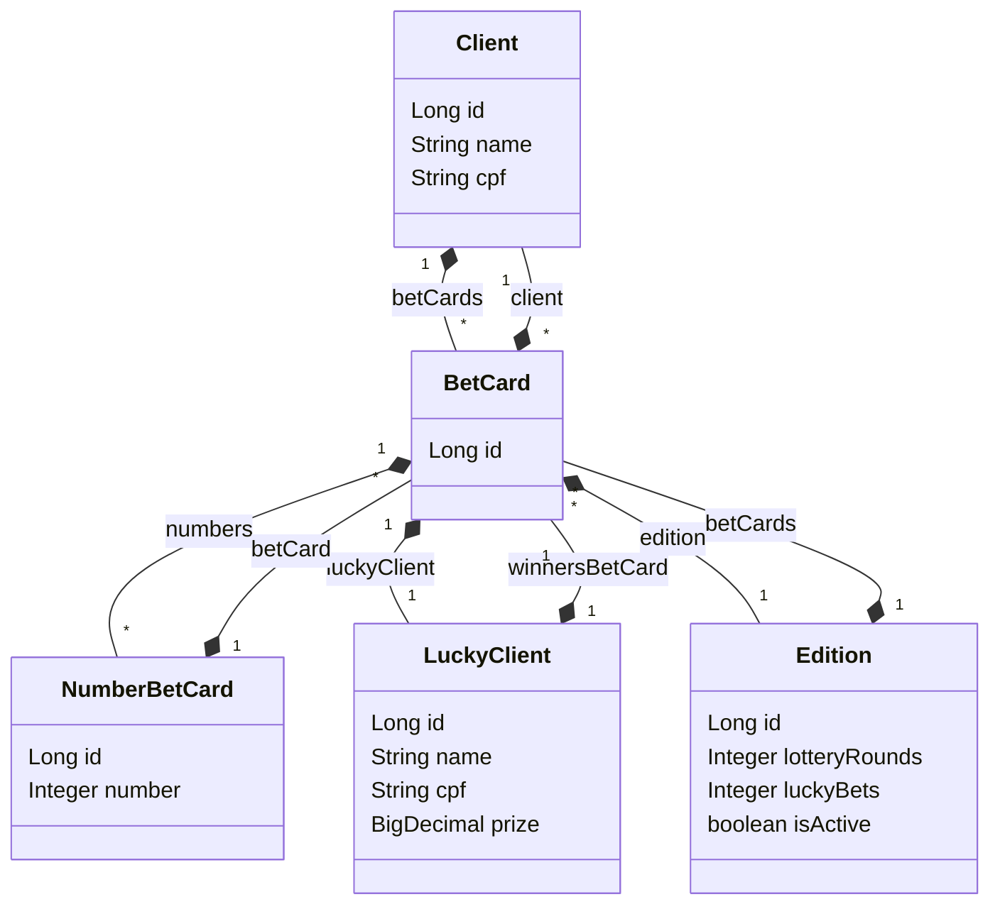

# DELL IT ACADEMY 20

## Pré-Requisitos

Antes de iniciar, certifique-se de ter em seu dispositivo as seguintes ferramentas:

- Java e JDK
- Maven
- Node.js e npm

Certifique-se de ter uma versão compatível com as versão citadas para o funcionamento correto do projeto.

- O backend do projeto foi feito em JAVA + SPRING BOOT, com o gerenciador de pacotes maven.
  - Java 17.0.7
  - JDK 18.0.2.1
  - Maven 3.9.3
- O frontend do projeto foi feito em React + Vite js.
  - Node 20.5.0
  - Npm 9.8.1

## Estrutura de pastas do projeto

- O projeto está dividido em duas partes: frontend e backend. Sendo necessário no mínimo 2 terminais/IDE para a utilização completa do projeto.
- O projeto possui as pastas com seus nomes dedicados para cada parte.
- O banco de dados é o H2 junto ao JPA Repository, os quais já estão como dependências no pom.xml encontrado na parte do backend, sendo necessário somente uma conexão com a internet para que o Maven possa baixar as depedências do projeto pela primeira vez.

# Inicialização do projeto

### Backend

1. Abra o projeto na sua IDE que suporte Java. Aconselho o uso do Intellij IDEA, pois foi o mesmo no qual o projeto foi feito, na versão 2023.2.6.

   1.1. Espere o Maven carregar o projeto.

2. Navegue até a classe principal (Classe com o método `main`), localizado em /Backend/dell_it_academy_backend/src/main/java/com/murakami/dell_it_academy_backend/DellItAcademyBackendApplication.java
3. Clique com o botão direito no mouse da clase e selecione `Run dell_it_academy_backend`

   3.1. Alternativamente `Shift + f10` para iniciar o projeto.

### Backend Console

1. Navegue até a pasta raiz do projeto pelo console.
2. Execute o comando `mvn clean install` para construir o projeto com maven.
3. Depois que a "build" estiver concluída, navegue até a pasta `target`
4. Execute o comando `java -jar dell_it_academy_backend-0.0.1-SNAPSHOT.jar`

### Frontend

1. Navegue até a pasta da raiz do projeto pelo console.
2. Instale as depêndencias do projeto com o comando `npm install`
3. Inicie a aplicação com o comando `npm run dev`

## Diagrama de Classes da aplicação

